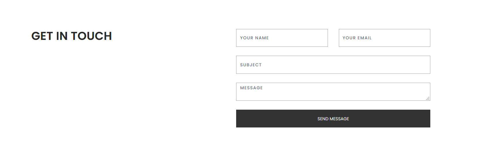
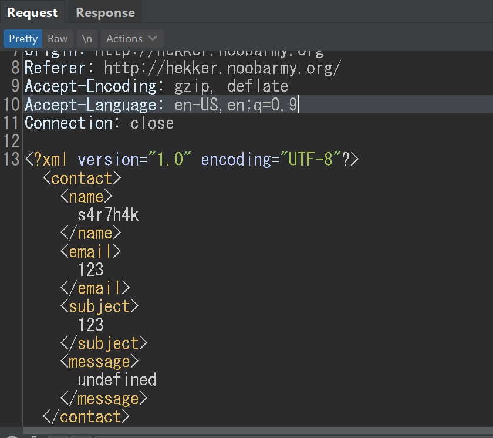
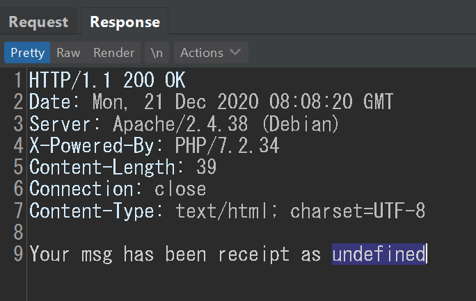
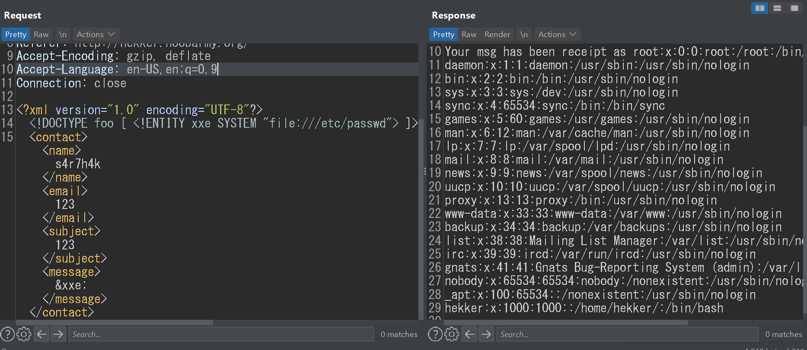

# XXE
##### URL:  [Link](http://hekker.noobarmy.org/ "Mr. Hekker")

* This was the form present in homepage.

* The POST request being sent:

* Response:

+ ##### We can try XML external entity (XXE) injection.

This confirms the _vulnerability_.

+ Now we can get the flag at */home/hekker/flag.txt*
			_vulncon{MR_H4kk3r_w1th_XXE_(+_+)}_